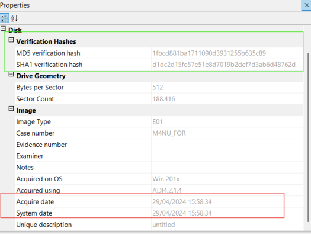
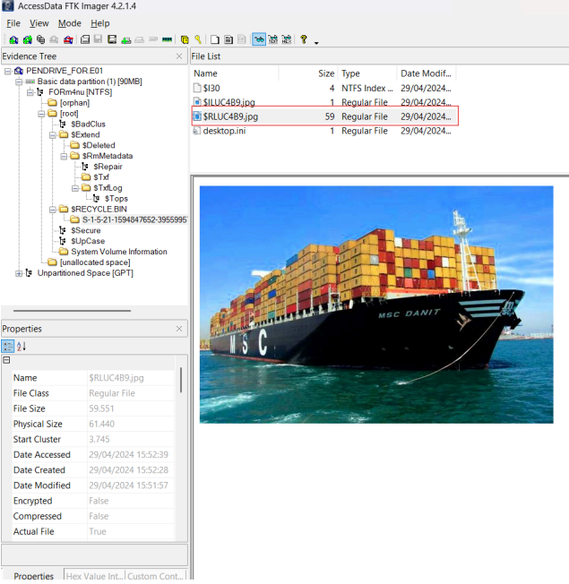
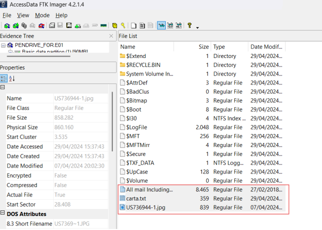
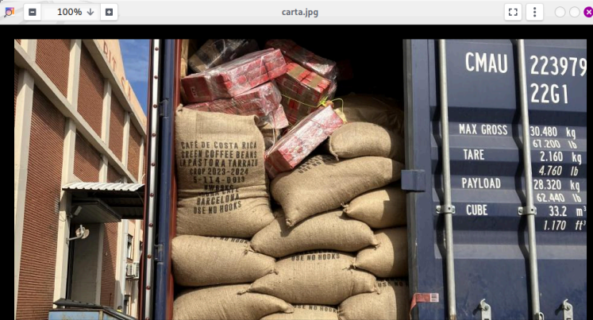
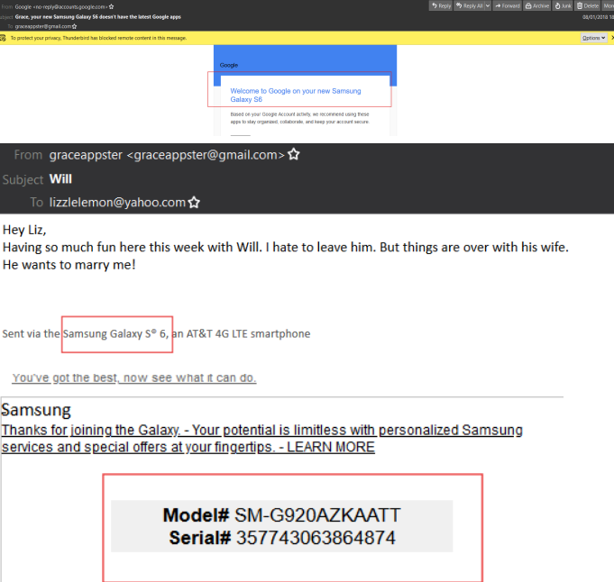
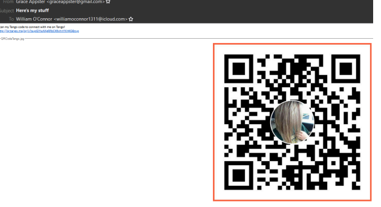

# 01 · DFIR — Análisis Forense de Pendrive · Narcotráfico

> **Categoría:** DFIR · Forense Digital
> **Herramientas:** FTK Imager · Kali Purple · Thunderbird
> **Contexto:** Laboratorio del Máster en Ciberseguridad · IMMUNE x Universidad Nebrija x Banco Santander

***

## Escenario

En el contexto de una investigación de narcotráfico, se interviene un pendrive perteneciente a un sospechoso vinculado al grupo criminal **Reboot**. El objetivo del análisis es extraer evidencias digitales que permitan identificar al infiltrado policial dentro de la organización y reconstruir el plan operativo del grupo.

Los recursos proporcionados son los siguientes: la imagen forense `PENDRIVE_FOR.E01`, el documento de acompañamiento `PENDRIVE_FOR.E01.txt` con los hashes de referencia, un cliente Thunderbird portable con el perfil de correo a analizar (`ThunderbirdPortableIMPORT_NEW.rar`), y la herramienta `AccessData FTK Imager 4.2.1`.

***

## Write-up

### 1. Verificación de integridad de la cadena de custodia

El primer paso en cualquier análisis forense es garantizar la integridad de la evidencia antes de manipularla. Para ello cargué la imagen `PENDRIVE_FOR.E01` en FTK Imager y ejecuté la verificación de hashes desde `File → Verify Drive/Image`.

FTK Imager calcula los hashes MD5 y SHA1 del archivo `.E01` y los compara automáticamente contra los valores embebidos en el propio contenedor forense. Los resultados obtenidos coinciden con los del documento `.txt` de acompañamiento:

```
MD5:  1fbcd881ba1711090d3931255b635c89   Match ✅
SHA1: d1dc2d15fe57e51e8d7019b2def7d3ab6d48762d   Match ✅
```

El panel Properties de FTK Imager revela los metadatos de adquisición: la imagen fue capturada el **29/04/2024 a las 15:58:34** con la herramienta ADI 4.2.1.4 sobre un sistema Win 201x, sin bad blocks detectados. La imagen es íntegra y no ha sido modificada desde su adquisición, lo que valida la cadena de custodia para el análisis posterior.



***

### 2. Reconocimiento del sistema de archivos NTFS

Con la integridad verificada, procedí a explorar la estructura del volumen. FTK Imager identifica la partición como **FORm4nu [NTFS]** (90 MB). A primera vista el sistema de archivos parece vacío: no hay archivos de usuario en `[root]`. Esto es una señal de alerta, ya que un volumen NTFS siempre contiene metadatos del sistema aunque esté "vacío".

El análisis no puede limitarse al directorio raíz visible. En un análisis forense completo es obligatorio examinar tres zonas clave: `$RECYCLE.BIN` para archivos eliminados, el espacio no asignado (`[unallocated space]`) para archivos huérfanos no referenciados en la MFT, y `System Volume Information` para metadatos del sistema.

***

### 3. Recuperación de archivo eliminado en $RECYCLE.BIN

Navegando a `$RECYCLE.BIN\S-1-5-21-1594847652-395599576-2066796737-1000` localicé el archivo `$RLUC4B9.jpg`. En NTFS, la Papelera de Reciclaje almacena los archivos eliminados renombrándolos con el prefijo `$R` seguido de un identificador aleatorio. El archivo `$I` correspondiente contiene el nombre original y la fecha de eliminación.

El panel Properties de FTK Imager muestra los metadatos del archivo:

```
Date Accessed:  29/04/2024 15:52:39
Date Created:   29/04/2024 15:52:28
Software:       Picasa
```

La fecha de acceso y creación coincide con el mismo día de la adquisición forense, lo que indica que el sospechoso **eliminó este archivo justo antes o durante la intervención**, en un intento deliberado de destruir evidencia. El visor de FTK Imager muestra la imagen: el buque portacontenedores **MSC DANIT**, nombre en clave de la operación criminal.



***

### 4. Análisis del espacio no asignado y detección de file type spoofing

El espacio no asignado (`[unallocated space]`) es una de las zonas más valiosas en un análisis forense: contiene datos de archivos que fueron eliminados pero cuyo contenido no ha sido sobreescrito aún. FTK Imager permite navegar por este espacio y visualizar los archivos recuperables.

Localicé tres archivos en esta zona:

```
All mail Including Spam and Trash.mbox   8.465 KB
carta.txt                                  359 KB
US736944-1.jpg                             839 KB
```



El archivo `carta.txt` levantó sospechas inmediatamente: **un archivo de texto plano no debería ocupar 359 KB**. Exporté el archivo desde FTK Imager y lo analicé en Kali Purple con el comando `file`, que identifica el tipo real de un archivo leyendo sus **magic bytes** (los primeros bytes del archivo, que actúan como firma del formato), independientemente de la extensión:

```bash
file carta.txt
carta.txt: JPEG image data, JFIF standard 1.01, resolution (DPI), density 96x96...
```

La firma `FF D8 FF` al inicio del fichero es inequívocamente un JPEG. El sospechoso había renombrado la imagen de `.jpg` a `.txt` para ocultarla ante una inspección superficial del explorador de archivos, una técnica de ofuscación conocida como **file type spoofing**. La extensión es solo un atributo del nombre del archivo; el tipo real viene determinado por el contenido binario.

Para visualizar la imagen renombré el fichero y lo abrí con el visor de Kali:

```bash
cp carta.txt carta.jpg
eog carta.jpg
```

La imagen revela el interior de un contenedor de carga con sacos de café de Costa Rica. En el lateral del contenedor se lee claramente el identificador **CMAU 223979 22G1**, el contenedor objetivo donde la organización ocultaba la droga entre carga legítima.



***

### 5. Email forensics: importación del archivo .mbox en Thunderbird

El tercer archivo recuperado del espacio no asignado, `All mail Including Spam and Trash.mbox`, es un volcado completo del buzón de correo en formato MBOX, el estándar de almacenamiento de emails de clientes como Thunderbird o Gmail Takeout.

Exporté el archivo desde FTK Imager y lo importé en Thunderbird mediante la extensión **ImportExportTools NG**, seleccionando previamente `Local Folders` como carpeta destino para evitar errores de importación en cuentas IMAP:

```
Tools → ImportExportTools NG → Import mbox file
```

Se recuperaron **199 emails** completos de la cuenta `graceappster@gmail.com`, incluyendo correos recibidos, enviados, spam y papelera, tal como indica el nombre del archivo.

***

### 6. Reconstrucción del perfil del sospechoso a partir de los emails

Con los 199 emails cargados en Thunderbird procedí al análisis sistemático de las comunicaciones para construir el perfil del infiltrado. Los hallazgos más relevantes son los siguientes:

**Identidad y dispositivo:** un email de bienvenida de Samsung confirma que Grace utilizaba un **Samsung Galaxy S6** con identificadores únicos que permiten vincular el dispositivo a la persona:

| Campo | Valor |
|-------|-------|
| **Nombre** | Grace Appster |
| **Email principal** | graceappster@gmail.com |
| **Email secundario** | grayseas77@yahoo.com |
| **Dispositivo** | Samsung Galaxy S6 |
| **Model#** | SM-G920AZKAATT |
| **Serial#** | 357743063864874 |
| **Cuenta creada** | 13/12/2017 22:42 |
| **Redes sociales** | Facebook · Instagram (@graceappster) |
| **Contactos** | William O'Connor (williamoconnor1311@icloud.com) · Liz (lizzlelemon@yahoo.com) |

Varios emails enviados desde el dispositivo incluyen la firma automática *"Sent via the Samsung Galaxy S6, an AT&T 4G LTE smartphone"*, lo que confirma que el dispositivo físico coincide con el registrado.



**Red de contactos:** se localizó un email de Grace a William O'Connor (`williamoconnor1311@icloud.com`) con asunto *"Here's my stuff"* que contiene un código QR de la aplicación de mensajería **Tango!**, utilizada habitualmente para comunicaciones encriptadas fuera de los canales convencionales.



***

## Resumen de hallazgos

| # | Hallazgo | Fuente |
|---|----------|--------|
| 1 | Fecha adquisición: 29/04/2024 15:58:34 | FTK Imager · Properties |
| 2 | MD5/SHA1 verificados · imagen íntegra | FTK Imager · Verify |
| 3 | Nombre en clave: **MSC DANIT** | $RECYCLE.BIN · $RLUC4B9.jpg |
| 4 | ID contenedor: **CMAU 223979 22G1** | Espacio no asignado · carta.txt (JPEG) |
| 5 | Dispositivo: **Samsung Galaxy S6** SM-G920AZKAATT | Emails · Thunderbird |
| 6 | Infiltrado: **Grace Appster** / graceappster@gmail.com | Emails · Thunderbird |
| 7 | Cuenta creada: **13/12/2017** | Email bienvenida Google |
| 8 | Redes sociales: **Facebook, Instagram** | Emails de registro |
| 9 | Contacto: **William O'Connor** | Email con QR Tango! |

***

## Técnicas demostradas

Verificación de cadena de custodia mediante hashes MD5/SHA1, análisis de sistema de archivos NTFS con FTK Imager, recuperación de archivos eliminados desde $RECYCLE.BIN, recuperación de archivos en espacio no asignado, detección de file type spoofing mediante magic bytes con el comando `file` en Linux, análisis de metadatos EXIF con exiftool, email forensics mediante importación y análisis de archivos .mbox, y reconstrucción de perfil de sospechoso a partir de comunicaciones digitales.

***

## Herramientas

| Herramienta | Uso |
|-------------|-----|
| FTK Imager 4.2.1 | Carga de imagen forense E01, verificación de hashes, exploración de sistema de archivos y espacio no asignado, extracción de archivos |
| Kali Purple | Identificación de tipo de archivo por magic bytes (`file`), visualización de metadatos EXIF (`exiftool`), análisis de strings |
| Thunderbird + ImportExportTools NG | Importación y análisis de archivo .mbox, reconstrucción de buzón de correo |

***

*Laboratorio realizado en el contexto del Máster en Ciberseguridad · IMMUNE x Universidad Nebrija x Banco Santander*
*Miguel Reguero · [LinkedIn](https://linkedin.com/in/miguel-reguero) · [GitHub](https://github.com/Miguel-R13)*
