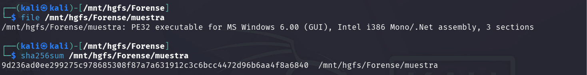
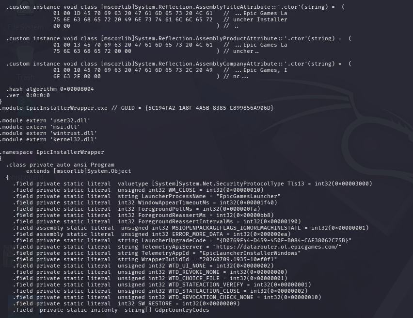
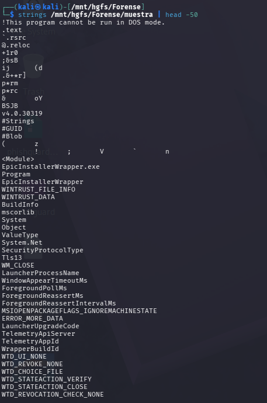
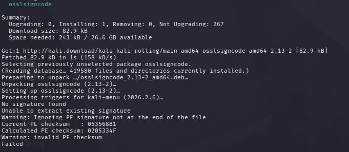
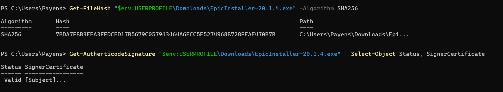

# Respuesta a Incidente: Trojan:Win32/Pomal!rfn
**Fecha:** 31 de julio de 2026  
**Analista:** MGL  
**Entorno:** Windows 11 (víctima) + Kali Purple (análisis estático básico)  
**Herramientas:** Windows Defender, monodis, osslsigncode, strings

---

## 1. Resumen ejecutivo

El 31 de julio de 2026 a las 10:51, Windows Defender interceptó en tiempo real un binario malicioso descargado a través del navegador Brave. El malware, clasificado como `Trojan:Win32/Pomal!rfn`, se presentaba como el instalador oficial de Epic Games Launcher (`EpicInstallerWrapper.exe`). El troyano nunca llegó a ejecutarse gracias a la detección preventiva de Defender. Se documentó el incidente completo: detección, investigación, análisis estático básico en entorno aislado y limpieza.

> **Nota:** Mi objetivo inicial era realizar un análisis forense completo del binario y del vector de entrada. Sin embargo, Windows Defender puso en cuarentena el archivo automáticamente antes de que pudiera intervenir, eliminando la evidencia de la URL de origen del registro de descargas de Brave. La muestra fue posteriormente restaurada desde la cuarentena para su análisis en entorno aislado, pero el vector de ataque no pudo confirmarse con certeza. Este informe cubre la respuesta al incidente y un análisis estático de superficie. El análisis de código se limitó a confirmar la suplantación de identidad y la manipulación del binario, sin llegar a la ingeniería inversa profunda del payload.

---

## 2. Vector de entrada

| Campo | Valor |
|---|---|
| Navegador | Brave Browser |
| Proceso | `C:\Users\XXX\AppData\Local\BraveSoftware\Brave-Browser\Application\brave.exe` |
| Búsqueda origen | `https://search.brave.com/search?q=epic+games&source=desktop` |
| Archivo descargado | `185bb705-c46d-4bda-a1d4-e6d97ae74bc7.tmp` |
| Ruta | `C:\Users\XXX\Downloads\` |
| También detectado en | `Brave Cache: ...Cache_Data\f_00a479` |
| Hora de detección | 31/07/2026 10:51 (hora local) |

Busqué "epic games" en Brave Search a las 10:51. Entré en el primer resultado que mostraba Epic Games, la página era visualmente idéntica a epicgames.com y no detecté nada sospechoso. Hice clic en el botón de descarga del launcher. Se descargó el instalador troyanizado y Windows Defender saltó con la alerta inmediatamente, poniendo el archivo en cuarentena de forma automática.

El historial de navegación no registra la URL de la página desde la que descargué el archivo. La cuarentena automática de Defender también eliminó la descarga del registro de Brave, y la posterior limpieza de caché borró evidencia adicional. No es posible determinar con certeza el mecanismo exacto que utilizó el atacante para posicionar esa página ni su URL real.

---

## 3. Detección y respuesta de Windows Defender

### Primera detección a las 10:51
- **Origen:** Protección en tiempo real
- **Acción:** Cuarentena automática
- **Estado:** `0x00000000` (operación completada correctamente)

### Segunda detección a las 11:19
Al trasladar la muestra a la carpeta compartida con la VM de Kali Purple para análisis, Defender detectó nuevamente el archivo y lo volvió a poner en cuarentena.

- **Ruta:** `C:\Users\XXX\Downloads\Forense\muestra`
- **Proceso:** `C:\Program Files (x86)\VMware\VMware Workstation\x64\vmware-vmx.exe`
- **Acción:** Cuarentena automática completada correctamente

El malware **nunca se ejecutó**. No hay rastro de ejecución en los logs de PowerShell Operational ni en los eventos del sistema.

---

## 4. Identificación de la muestra

| Campo | Valor |
|---|---|
| Nombre interno | `EpicInstallerWrapper.exe` |
| Tipo | PE32 executable (GUI), Intel i386, Mono/.NET assembly |
| Framework | .NET 4.5 |
| SHA-256 | `9d236ad0ee299275c978685308f87a7a631912c3c6bcc4472d96b6aa4f8a6840` |
| Tamaño | 33.867.314 bytes (~33 MB) |
| Clasificación Defender | `Trojan:Win32/Pomal!rfn` (ID: 2147925201, Gravedad: Grave) |
| VirusTotal | No indexado (muestra nueva) |

```bash
$ file /mnt/hgfs/Forense/muestra
PE32 executable for MS Windows 6.00 (GUI), Intel i386 Mono/.Net assembly, 3 sections

$ sha256sum /mnt/hgfs/Forense/muestra
9d236ad0ee299275c978685308f87a7a631912c3c6bcc4472d96b6aa4f8a6840
```



---

## 5. Análisis estático básico

El análisis se realizó en Kali Purple con herramientas de línea de comandos. El objetivo fue confirmar la naturaleza del binario sin ejecutarlo, no extraer el payload completo.

### 5.1 Suplantación de identidad

El binario copia con precisión los metadatos del instalador legítimo de Epic Games, lo que lo hace indistinguible visualmente de un instalador real:

| Atributo | Valor |
|---|---|
| `AssemblyTitle` | Epic Games Launcher Installer |
| `AssemblyCompany` | Epic Games, Inc. |
| `AssemblyProduct` | Epic Games Launcher |
| `WrapperBuildId` | `20260709.1935-10ef0f1` |
| `TelemetryApiServer` | `https://datarouter.ol.epicgames.com/` |
| `TelemetryAppId` | `EpicLauncherInstallerWindows` |
| `LauncherUpgradeCode` | `{D0769F44-D459-450F-B084-CAE38062C75B}` |
| `LauncherProcessName` | `EpicGamesLauncher` |

Extraído mediante `monodis`:

```
.assembly 'EpicInstallerWrapper'
.module EpicInstallerWrapper.exe // GUID = {5C194FA2-1A8F-4A5B-8385-E899856A906D}
  AssemblyTitleAttribute    -> "Epic Games Launcher Installer"
  AssemblyCompanyAttribute  -> "Epic Games, Inc."
  TelemetryApiServer        = "https://datarouter.ol.epicgames.com/"
  WrapperBuildId            = "20260709.1935-10ef0f1"
  LauncherUpgradeCode       = "{D0769F44-D459-450F-B084-CAE38062C75B}"
```





### 5.2 Verificación de firma digital

```bash
$ osslsigncode verify /mnt/hgfs/Forense/muestra

No signature found
Unable to extract existing signature
Warning: Ignoring PE signature not at the end of the file
Current PE checksum   : 053568B1
Calculated PE checksum: 0205334F
Warning: invalid PE checksum
Failed
```



Este es el hallazgo que confirma que el binario es malicioso:

- **Sin firma digital.** El instalador real de Epic Games siempre está firmado con un certificado Authenticode válido. La ausencia de firma es inmediatamente sospechosa.
- **Checksum PE inválido.** El checksum embebido en el PE (`053568B1`) no coincide con el calculado sobre el contenido real del archivo (`0205334F`). Esto indica que el binario fue **modificado después de su compilación** sin recalcular el checksum, patrón característico de binarios troyanizados.

> El análisis del código IL no reveló URLs de C2 externas ni carga dinámica de código en la superficie analizada. La parte modificada del binario requeriría ingeniería inversa más profunda con herramientas como dnSpy para ser identificada.

### 5.3 Descarte de falso positivo

Ante la posibilidad de que Defender hubiera generado un falso positivo, descargué el instalador oficial de Epic Games directamente desde epicgames.com (`EpicInstaller-20.1.4.exe`) y lo comparé con la muestra original.

```powershell
Get-FileHash "$env:USERPROFILE\Downloads\EpicInstaller-20.1.4.exe" -Algorithm SHA256
# SHA256: 7BDA7FBB3EEA3FFDCED17B5679C057943464A6ECC5E5274968B728FEAE470B7B

Get-AuthenticodeSignature "$env:USERPROFILE\Downloads\EpicInstaller-20.1.4.exe" | Select-Object Status, SignerCertificate
# Status: Valid
```

| | Muestra maliciosa | Instalador oficial (epicgames.com) |
|---|---|---|
| SHA-256 | `9d236ad0ee299275...` | `7BDA7FBB3EEA3FFD...` |
| Firma digital | Sin firma | Válida (Authenticode) |
| Checksum PE | Inválido | Válido |



Los hashes son completamente distintos y el instalador oficial tiene firma digital válida. **Falso positivo descartado con evidencia objetiva.**

---

## 6. Respuesta al incidente y limpieza

### 6.1 Respuesta inmediata
Windows Defender interceptó y puso en cuarentena el binario **automáticamente** en tiempo real a las 10:51, antes de cualquier ejecución. Con la protección en tiempo real activada y la amenaza clasificada como gravedad "Grave", Defender actuó sin requerir confirmación. Recibí la notificación emergente una vez la cuarentena ya estaba ejecutada.

Si bien esta respuesta automática protegió el sistema, tuvo una consecuencia forense importante: la cuarentena automática eliminó el archivo del registro de descargas de Brave y borró la evidencia de la URL de origen antes de que pudiera ser preservada. Esto impidió confirmar con certeza el vector de ataque.

### 6.2 Investigación post-incidente
Revisé los siguientes artefactos para confirmar que el malware no llegó a ejecutarse ni a persistir:

- **Visor de eventos de Windows.** Los eventos 1116 y 1117 de Microsoft Defender confirmaron las dos detecciones y sus remediaciones exitosas.
- **PowerShell Operational log.** Sin ejecución de scripts sospechosos en la ventana temporal del incidente.
- **Tareas programadas.** Ninguna tarea anómala fuera del path `\Microsoft\*`.
- **Autoruns (HKCU / HKLM).** Todas las entradas de inicio correspondían a software legítimo instalado.
- **Conexiones de red activas.** Sin conexiones a IPs sospechosas.

### 6.3 Limpieza

**Windows:**
- Exclusión de Defender eliminada: `Remove-MpPreference -ExclusionPath "C:\Users\XXX\Downloads\Forense"`
- Cuarentena de Defender vaciada
- Caché de Brave eliminada (contenía el archivo malicioso `f_00a479`): `Remove-Item "$env:LOCALAPPDATA\BraveSoftware\Brave-Browser\User Data\Default\Cache\Cache_Data\*" -Force -Recurse`

**Kali Purple:**
- Desensamblado eliminado: `rm -f /tmp/muestra_dis`
- Verificado que no quedaron restos de la muestra en el sistema

---

## 7. Conclusión

El incidente fue contenido correctamente por Windows Defender sin intervención manual. La investigación posterior confirmó que el sistema no fue comprometido: no hay persistencia, no hay ejecución, no hay comunicaciones externas sospechosas.

El binario empleaba una técnica de **suplantación de identidad** sofisticada, copiando exactamente los metadatos del instalador legítimo de Epic Games. La detección de su naturaleza maliciosa se basó en dos evidencias técnicas: ausencia de firma digital Authenticode y checksum PE inválido, ambas indicativas de un binario modificado post-compilación.

---

## 8. Indicadores de Compromiso (IOCs)

| Tipo | Valor |
|---|---|
| SHA-256 | `9d236ad0ee299275c978685308f87a7a631912c3c6bcc4472d96b6aa4f8a6840` |
| Nombre del malware | `Trojan:Win32/Pomal!rfn` |
| Threat ID | `2147925201` |
| Nombre interno | `EpicInstallerWrapper.exe` |
| Build ID | `20260709.1935-10ef0f1` |
| GUID del módulo | `{5C194FA2-1A8F-4A5B-8385-E899856A906D}` |

---

## 9. Lecciones aprendidas

- En un contexto de análisis forense, antes de que Defender actúe, hay que preservar una copia del archivo sospechoso y del historial de navegación completo antes de cualquier limpieza. La cuarentena automática de Defender borró evidencia clave en este incidente.
- Instalar **Sysmon** antes de que ocurra un incidente. Habría registrado las conexiones de red por proceso y permitido identificar el vector con certeza.
- Descargar software siempre desde la URL oficial tecleándola directamente en el navegador, nunca desde resultados de búsqueda.
- Verificar la **firma digital** de cualquier ejecutable antes de ejecutarlo (clic derecho, Propiedades, Firmas digitales).
- Un binario puede copiar metadatos legítimos perfectamente. La firma digital y el checksum PE son las pruebas definitivas de autenticidad.
